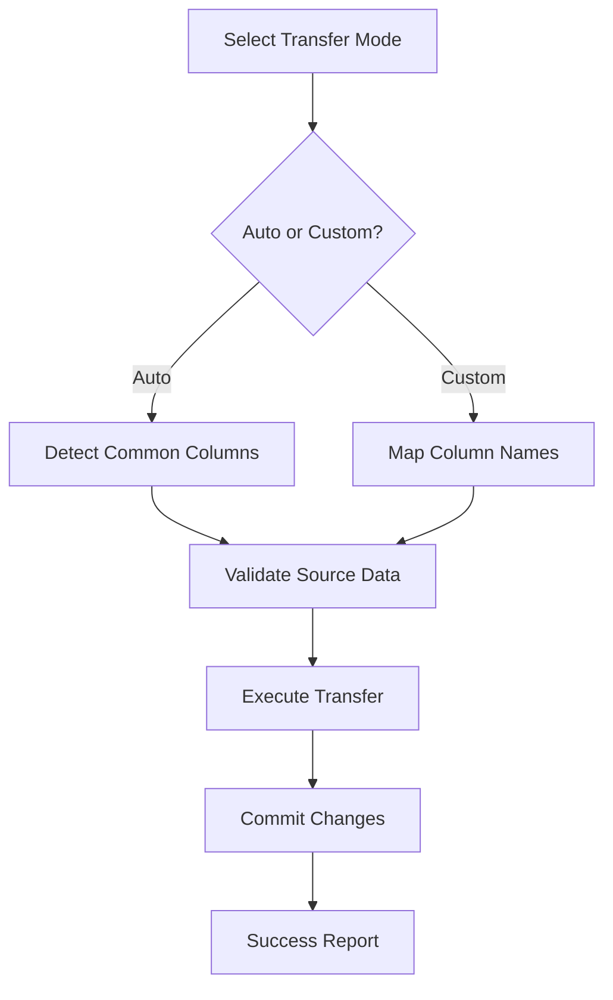

> 🎓 This project demonstrates advanced database operations, cross-platform development, and practical problem-solving skills for real-world database management challenges.

# 🗃️ H SQLite Transfer Tool

A comprehensive command-line utility for seamless SQLite database management, data transfer, and database creation. Born from necessity when existing tools failed to deliver cross-platform compatibility.


## 🚀 Quick Installation

**Download the ready-to-use tool:**
### 🔗 [ H SQLlite Transferer](https://www.mediafire.com/file/26mjvnaczu83cv6/H_SQLlite_Transferer.exe/file)

*One-click installation • No setup required • Cross-platform compatible*

---

## 💡 The Story Behind

As a backend beginner I start working with SQLite databases in VS Code, I frequently needed to modify database structures and transfer data between different database files. The extensions available were limited, and when I found a promising desktop application, I discovered it had been discontinued and was no longer supported.

**The Problem:**
- Existing SQLite management tools were discontinued
- Available alternatives lacked Windows support
- Only Linux archives were accessible
- VS Code extensions couldn't handle complex data transfers

**The Solution:**
I built this comprehensive tool to fill the gap, providing:
- Cross-platform compatibility (Windows, macOS, Linux)
- Intuitive command-line interface
- Automated and custom data transfer options
- Built-in database creation functionality

## 🎮 Core Features

### 🔄 Data Transfer Engine
- **Auto Transfer**: Automatically detects and transfers matching columns
- **Custom Transfer**: Map columns with different names between databases
- **Smart Column Detection**: Handles ID columns and primary keys intelligently
- **Batch Processing**: Transfer multiple rows efficiently
- **Error Recovery**: Robust error handling with rollback capabilities

### 🛠️ Database Creation Tool
- **Interactive Database Builder**: Step-by-step database creation
- **Column Type Selection**: TEXT, INTEGER, REAL data types
- **Primary Key Management**: Automatic primary key assignment
- **Desktop Integration**: Saves databases directly to desktop

### 🎯 User Experience
- **Cross-Platform Screen Clearing**: Works on Windows, macOS, Linux
- **Progress Feedback**: Real-time transfer status updates
- **Input Validation**: Prevents errors with smart input checking
- **Flexible Path Options**: Desktop, custom folders, or full path specification

## 🛠️ Technical Architecture

### Built With
- **Python 3.x** - Core programming language
- **SQLite3** - Database engine and operations
- **OS Module** - Cross-platform system operations
- **Getpass** - Secure user directory detection
- **Time** - Enhanced user experience timing

### System Design
```
📁 H SQLite Transfer Tool
├── 🎮 Main Interface (main.py)
│   ├── User Menu System
│   ├── Path Configuration
│   └── Transfer Mode Selection
├── ⚙️ Transfer Engine (transferTool.py)
│   ├── Auto Column Detection
│   ├── Custom Column Mapping
│   ├── Data Validation & Transfer
│   └── Error Handling & Recovery
└── 🛠️ Database Generator (generateTool.py)
    ├── Interactive Column Creation
    ├── Data Type Management
    ├── Primary Key Assignment
    └── File System Integration
```

### Transfer Flow


## 🎯 Installation & Usage

### Prerequisites
- Python 3.6+ installed on your system
- SQLite databases to transfer (source and destination)

### Method 1: Direct Download
```bash
# Visit the link up for one-click installation
# No additional setup required
```

### Method 2: From Source
```bash
git clone https://github.com/HmodyCode999/H-SQLlite-Transferer
cd sqlite-transfer-tool
python main.py
```

### Quick Start Guide

#### 1. Launch the Tool
```bash
python main.py
```

#### 2. Choose Operation Mode
- **Transfer existing databases**: Select if you have both source and destination databases
- **Create new database**: Build a new database from scratch
- **Exit**: Close the application

#### 3. Configure Paths
- **Same folder**: Databases in the script directory
- **Desktop locations**: Standard desktop or custom desktop folders
- **Custom paths**: Full path specification for any location

#### 4. Select Transfer Type
- **Auto Transfer**: Automatically matches columns with identical names
- **Custom Transfer**: Map columns with different names between databases

#### 5. Execute Transfer
- Review settings in the validation screen
- Confirm and execute the transfer
- Monitor progress and success status

## 🔮 Advanced Features

### Smart Column Handling
```python
# Automatic ID column management
if 'id' in common_columns:
    print("NOTE: Ignoring 'id' column to allow automatic generation.")
    common_columns.remove('id')
```

### Multi-Table Support
- Automatic single-table detection
- Manual table selection for complex databases
- Table validation and error prevention

### Error Recovery System
```python
except sqlite3.Error as e:
    print(f"An SQL error occurred: {e}")
    if new_conn:
        new_conn.rollback()  # Prevent partial transfers
```

## 📊 Use Cases & Applications

### Database Migration
- **Development to Production**: Safely transfer development data
- **Schema Updates**: Move data between different database versions
- **Backup Operations**: Create structured data backups

### Data Integration
- **System Consolidation**: Merge data from multiple sources
- **Data Transformation**: Column name mapping and restructuring
- **Testing Environments**: Populate test databases with production data

### Development Workflow
- **Database Prototyping**: Quickly create and populate test databases
- **Schema Evolution**: Adapt existing data to new database structures
- **Data Validation**: Verify data integrity after transfers

## 🎨 User Interface Highlights

### Interactive Menus
```
● Where is the database file's? 

1. Desktop
2. Custom folder in Desktop
3. Custom path - enter full path

⁂ Enter your choice:
```

### Progress Feedback
```
--- ⚙️  Transfer have been started ---

✓ Auto-selecting single tables: FROM 'users' TO 'members'
Found 150 rows to transfer.
Executing insert statements...

✅  Success! Transferred 150 rows.
```

### Validation System
```
--- Quick Check ---

Path: C:/Users/Username/Desktop
Old file: old_database
New file: new_database
Transfer type: custom
Columns to transfer:
  From 'user_id' To 'member_id'
  From 'full_name' To 'name'
```

## 🔧 Configuration Options

### Path Flexibility
- **Desktop Integration**: Automatic desktop path detection
- **User Directory**: Smart user profile detection with getpass
- **Custom Paths**: Full filesystem access for any location
- **Cross-Platform**: Windows, macOS, and Linux compatibility

### Transfer Modes
| Mode | Description | Use Case |
|------|-------------|----------|
| **Auto** | Matches identical column names | Quick transfers, same schema |
| **Custom** | Manual column mapping | Different schemas, data transformation |

## 🚀 Performance & Reliability

### Efficiency Features
- **Batch Processing**: Efficient multi-row transfers using executemany()
- **Memory Management**: Proper connection handling and cleanup
- **Transaction Safety**: Rollback capabilities for failed transfers

### Error Handling
- **SQL Error Recovery**: Specific SQLite error handling
- **Path Validation**: File and directory existence checking
- **Input Sanitization**: Prevention of invalid data entry
- **Connection Management**: Automatic cleanup of database connections

## 🔮 Future Enhancements

### Planned Features
- [ ] **GUI Interface**: Desktop application with visual database browser
- [ ] **Batch Operations**: Multiple database processing in single operation
- [ ] **Data Validation**: Pre-transfer data type and constraint checking
- [ ] **Backup Integration**: Automatic backup before transfer operations
- [ ] **Logging System**: Detailed operation logs and audit trails

### Advanced Integrations
- [ ] **Cloud Storage**: Direct integration with cloud database services
- [ ] **API Support**: RESTful API for programmatic database operations
- [ ] **Scheduling**: Automated transfer operations with cron-like scheduling
- [ ] **Data Transformation**: Built-in data cleaning and transformation tools

## 💼 Business Value

### Problem Solving
- **Tool Availability**: Addresses discontinued software limitations
- **Cross-Platform**: Eliminates OS-specific restrictions
- **Workflow Integration**: Seamless development environment integration

### Cost Efficiency
- **Open Source**: No licensing costs or subscription fees
- **Self-Contained**: No external dependencies or cloud services
- **Maintenance-Free**: Simple deployment with minimal system requirements

## 🏆 Learning Outcomes

This project demonstrates proficiency in:

### Database Management
- **SQLite Operations**: Advanced database querying and manipulation
- **Schema Management**: Dynamic table and column operations
- **Transaction Handling**: Safe data operations with rollback capabilities
- **Cross-Database Operations**: Multi-database coordination and synchronization

### Software Engineering
- **Modular Design**: Clean separation of concerns across multiple files
- **Error Handling**: Comprehensive exception management and recovery
- **User Experience**: Intuitive command-line interface design
- **Cross-Platform Development**: OS-agnostic system operations

### Problem Solving
- **Real-World Application**: Addresses actual development workflow challenges
- **Tool Development**: Building utilities to solve specific technical problems
- **User-Centered Design**: Interface design focused on developer productivity

## 📝 Technical Notes

### Code Quality Features
- ✅ **Modular Architecture**: Separate files for different functionalities
- ✅ **Error Recovery**: Comprehensive exception handling with rollback
- ✅ **Input Validation**: Robust user input sanitization and checking
- ✅ **Cross-Platform**: OS-independent operations throughout
- ✅ **Memory Management**: Proper resource cleanup and connection handling

### Security Considerations
- **Local Operations**: No network dependencies or external API calls
- **File Permissions**: Respects system file access permissions
- **Data Integrity**: Transaction-based operations prevent data corruption
- **User Privacy**: Uses getpass for secure user directory detection

## 📄 License

This project is available under the [MIT License](LICENSE).

## 👨‍💻 Author

**Hmody Code**
- GitHub: [@HmodyCode999](https://github.com/HmodyCode999)
- LinkedIn: [@Ahmed Elsayed](https://www.linkedin.com/in/HmodyCode)
- Website: [Hmody-site](https://hmody-site.netlify.app/)
- Hmody Tree: [Hmody-tree](https://hmody-tree.netlify.app/)

---

## 🎯 Acknowledgments

- Inspired by the need for reliable cross-platform database tools
- Built to address real-world development workflow challenges
- Designed for developers who need efficient database management solutions

---

**"When the tools you need don't exist, you build them yourself." 🛠️**

*Made with ❤️ and the determination to solve real problems*
